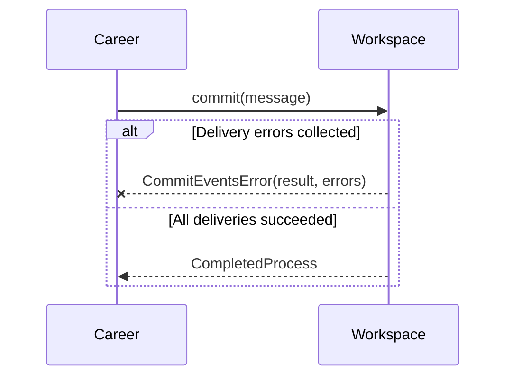

# Career OS agent instructions

Career OS is a git-backed career archive: a CLI (`career`) that captures
resources and records history in a private Git repository, organised as
Career → Context → Mission → Thread.

## Roles

- The **project owner** is the design authority. Every design, conception or
  architecture choice is validated by them.
- An **architect agent** writes issues and reviews pull requests against the
  issues' acceptance criteria.
- **Developer agents** implement issues. The GitHub issues are the source of
  truth for behaviour; the code you write must satisfy their acceptance
  criteria.

If something is not specified by the issue, or you see a conflict between an
issue and the code, **stop and ask** in the issue or the pull request. Do not
settle design questions yourself, and do not silently deviate from an issue.

## Current work

The event foundation is tracked in #1 with child issues #2 to #9. Read #1 first,
then the issue you are assigned. Suggested order: #2, #3 and #4 in parallel,
then #5, then #6, #7 and #8. #9 is a debt checklist, not to be implemented.

## Repository layout

- `src/` flat Python modules. `main.py` is the CLI entry point.
- `src/template/singleton.py` is the `Singleton` metaclass.
- `tests/test_core_conformance.py` is the black-box conformance suite (real Git,
  one subprocess per CLI call).
- `.career/HEAD.json` at the repository root is tracked. See "Pitfalls".

## Architecture

The call chain of a command is:

```text
main.py (CLI parsing, output, exit code)
→ Career (façade)
→ Workspace (owns Head: context / mission / thread)
→ Repository (filesystem + Git coordination)
→ Git (thin subprocess wrapper, no Career knowledge)
```

- `Head` and `Repository` are singletons. `paths.REPO_DIR` and `HEAD_FILE` are
  computed once at import time, from `CAREER_REPO_DIR` or the working directory.
- Errors derive from `CareerError` (`kind`, `returncode`); `main.main()` prints
  them and returns their exit code.
- `Git.commit` accepts exit code 1 ("nothing to commit") without raising.
- `Workspace.commit` is the public commit path. `start_*` / `finish_*` call
  `Repository.commit` directly.
- Keep the layering: each layer calls only the one below it. Git commands are
  executed only inside `Git`.

## Conventions

- Python 3.14, standard library only. No new dependency.
- Tests use `unittest`, no pytest. New tests use real Git in temporary
  directories, like the existing suite.
- Docstrings follow the existing Doxygen-like style: `@brief`, `@param`,
  `@return`. Match the surrounding code's naming and comment density.
- Type-annotate new code, consistent with the existing annotations.
- Keep changes small and focused on the assigned issue. No general refactoring.

## Code and architecture quality

Quality is a review criterion, not a preference. Reviewers challenge these
points before they look at the tests; passing tests do not make code
acceptable.

- **Language and standard library first.** Before writing a helper, check
  whether Python already does it (`repr`, `dataclasses`, `pathlib`, ...). Never
  re-implement a standard behaviour by hand. If you hesitate between a bespoke
  solution and a standard one, use the standard one and say so in the pull
  request.
- **Small and simple.** Short functions with a single responsibility. No
  duplicated blocks: when the same construction appears more than twice,
  extract a named helper. No speculative abstraction, option or flexibility
  that the issue does not ask for.
- **Readable first.** Intention-revealing names. A nested comprehension or
  generator that needs a comment to be understood becomes a loop or a named
  function. Comments explain why, not what.
- **Respect the layers.** Dependencies point downward (`main` → `Career` →
  `Workspace` → `Repository` → `Git`). Wording and presentation stay in the
  layer that owns them. Business code does not know the CLI, and `Git` knows
  nothing about Career. Do not reach across layers.
- **No extra API surface.** Add only the public functions, parameters and
  options the issue specifies.
- **Explicit errors.** No bare `except`, no silently swallowed exception.
- **Tests protect behaviour.** Every branch you add must be covered by a test
  that fails when that branch is removed. Delete the tests of code you remove.

## Sequence diagrams for interface changes

When a pull request adds or changes an interface, its description must contain
a Mermaid `sequenceDiagram`. An interface change is any of:

- a public function or method: signature, return type, or exception raised
  across a module boundary;
- a class or `Protocol` used by another module;
- the observable behaviour of a CLI command (output, `stderr`, exit code);
- an event type or its schema, or any persisted format.

The diagram shows the participants involved (`main`, `Career`, `Workspace`,
`Repository`, `Git`, the event bus, ...), the calls with their arguments and
results, and the alternative branches (`alt` / `else`) for errors and edge
cases. Mark what is new or changed, and show the previous flow when an existing
one changes. Keep the diagram up to date when the pull request evolves during
review. When there is no interface change, write "No interface change." in the
description. Issues that define a new interface should include a diagram too.



## Development workflow

1. Write the tests first and check that they fail for the right reason.
2. Implement until the tests pass.
3. Run the existing conformance suite and compare with the baseline below.
4. One branch and one pull request per issue. Reference the issue number.
   Never commit to `main` directly. Name the branch as described below.
5. Do not include unrelated changes, and do not modify the assertions of
   `tests/test_core_conformance.py`.
6. Before asking for review, re-read your diff against "Code and architecture
   quality", and add the sequence diagram if an interface changed.

## Branch naming

    <type>/<issue>-<short-topic>
    chore/<short-topic>  # when no issue exists

- `type` is one of `feat` (behaviour), `test` (tests or test tooling only),
  `docs`, `fix`, `chore`.
- `issue` is the number of the GitHub issue (omit it only for `chore/<short-topic>`).
- `short-topic` is lowercase ASCII, words separated by hyphens, 4 words at most.

Examples: `test/2-inprocess-harness`, `feat/6-commit-events`,
`docs/8-events-contract`, `chore/agents-md`.

Rules:

- One branch per issue, created from an up-to-date `origin/main`.
- No branch named after an agent or a person, and no permanent branch.
- If an issue depends on one that is not merged yet, wait for the merge rather
  than stacking branches, unless the project owner says otherwise.
- Delete the branch once its pull request is merged.

## Commands

Run from the repository root. Python bytecode is ignored, so
`PYTHONDONTWRITEBYTECODE=1` is optional rather than required to keep the working
tree clean.

```bash
python tests/test_core_conformance.py
```

Baseline on `main` (measured at commit 675dce5): 54 tests, 6 known failures that are not
regressions and must not be "fixed" as part of the event work (re-measure on current `main` if needed):

- `test_context_finish`
- `test_mission_finish`
- `test_thread_finish`
- `test_fresh_init_retains_root_after_first_context`
- `test_inconsistent_head_is_rejected_before_capture`
- `test_sibling_thread_branches_from_structural_parent`

Your change must keep every other test passing and must not add failures.

## Pitfalls

- Running `career` from inside this repository is dangerous: `.career/HEAD.json`
  is tracked at the root, so `paths.py` discovers the source repository itself
  as a Career repository. Always set `CAREER_REPO_DIR` to a temporary directory
  when trying the CLI by hand.
- Python bytecode is ignored. Do not force-add `__pycache__` directories or
  `.pyc` files.
- Tests must never write outside their temporary directories.
- Git configuration used by tests must be isolated (see `setUp` of the existing
  suite: `GIT_CONFIG_GLOBAL`, `GIT_CONFIG_NOSYSTEM`, author and committer
  variables).

## Event foundation invariants (see #1 for the full contract)

- Events are published only from `Workspace.commit`.
- `Git`, `Repository` and the CLI never build or know events.
- Publishing an event never writes a file or makes the Workspace dirty.
- A failing event handler never rolls back the Git commit.
- Events hold an immutable copy of the Head, never a reference to it.
