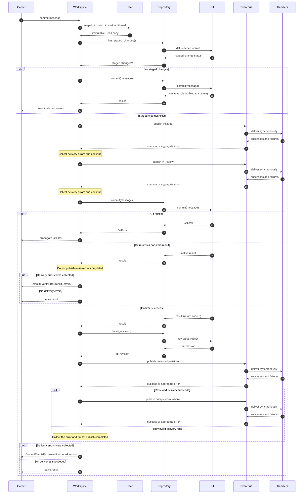

# Career commit event contract

This document defines the version 1 business-event contract for the public
Career commit operation. The events describe the lifecycle of one
`Workspace.commit` call; they are not a durable audit log or a replacement for
Git history.

## Commit lifecycle

For a commit with staged changes, the successful lifecycle is:

```text
initiated → in_review → [git commit] → reviewed → completed
```



| Event | Meaning | Intended future service boundary |
| --- | --- | --- |
| `career.commit.initiated` | A public commit operation has begun and passed the initial staged-change check. | Future services may suggest or recommend changes to the staged modifications. |
| `career.commit.in_review` | The operation has entered review. Review is automatic in version 1. | A future workflow may present service suggestions for the careerist to review. |
| `career.commit.reviewed` | Review is done, Git created the commit, and its full object ID is known. | Future knowledge services may update the Knowledge Base from the committed workspace revision. |
| `career.commit.completed` | The commit is capitalised: every `reviewed` handler succeeded. | Future services can treat successful review delivery as complete. |

The arrows describe publication order, not a guarantee that every operation
publishes all four events. Validation failures, an initially empty index, a Git
failure, or a failed `reviewed` handler can stop the sequence as described
below.

## Event model and catalogue

Every event is an immutable, frozen value. Its `to_dict()` result is directly
JSON-compatible and contains these common fields:

| Field | Contract |
| --- | --- |
| `schema_version` | The string `"1"`. Consumers must use this field to select the event schema. |
| `event_id` | A UUID string unique to this event. Each event in an operation has a different ID. |
| `operation_id` | A UUID string shared by all events from the same commit operation. |
| `event_type` | One of the four exact event names catalogued below. |
| `occurred_at` | A timezone-aware UTC ISO 8601 timestamp obtained from the system clock with whole-second precision. Its monotonicity is not guaranteed. |
| `head` | The immutable workspace snapshot captured for the operation, with exactly `context`, `mission`, and `thread` string fields. An absent level is represented by an empty string. |

Only `career.commit.reviewed` and `career.commit.completed` contain
`workspace_revision`. It is the full lowercase hexadecimal object ID of the
Git commit (40 characters for SHA-1 repositories or 64 for SHA-256
repositories). Events contain no commit message, captured content, or
free-form payload.

### `career.commit.initiated`

```json
{
  "schema_version": "1",
  "event_id": "aaaaaaaa-aaaa-4aaa-8aaa-aaaaaaaaaaa1",
  "operation_id": "11111111-1111-4111-8111-111111111111",
  "event_type": "career.commit.initiated",
  "occurred_at": "2026-09-20T12:00:00+00:00",
  "head": {
    "context": "snt",
    "mission": "daedalux",
    "thread": "architecture"
  }
}
```

### `career.commit.in_review`

```json
{
  "schema_version": "1",
  "event_id": "bbbbbbbb-bbbb-4bbb-8bbb-bbbbbbbbbbb2",
  "operation_id": "11111111-1111-4111-8111-111111111111",
  "event_type": "career.commit.in_review",
  "occurred_at": "2026-09-20T12:00:01+00:00",
  "head": {
    "context": "snt",
    "mission": "daedalux",
    "thread": "architecture"
  }
}
```

### `career.commit.reviewed`

```json
{
  "schema_version": "1",
  "event_id": "cccccccc-cccc-4ccc-8ccc-ccccccccccc3",
  "operation_id": "11111111-1111-4111-8111-111111111111",
  "event_type": "career.commit.reviewed",
  "occurred_at": "2026-09-20T12:00:02+00:00",
  "head": {
    "context": "snt",
    "mission": "daedalux",
    "thread": "architecture"
  },
  "workspace_revision": "0123456789abcdef0123456789abcdef01234567"
}
```

### `career.commit.completed`

```json
{
  "schema_version": "1",
  "event_id": "dddddddd-dddd-4ddd-8ddd-ddddddddddd4",
  "operation_id": "11111111-1111-4111-8111-111111111111",
  "event_type": "career.commit.completed",
  "occurred_at": "2026-09-20T12:00:03+00:00",
  "head": {
    "context": "snt",
    "mission": "daedalux",
    "thread": "architecture"
  },
  "workspace_revision": "0123456789abcdef0123456789abcdef01234567"
}
```

## Publication rules

`Workspace.commit` is the only event publisher. The event-producing path is:

1. The CLI validates the request before calling `Career.commit` and
   `Workspace.commit`. A validation failure publishes nothing.
2. `Workspace.commit` captures one immutable `Head` snapshot and checks the Git
   index. If nothing is staged at that check, it publishes nothing.
3. With staged changes, it publishes `initiated`, then `in_review`, and then
   asks the repository to create the Git commit.
4. After a successful Git commit, it reads the full revision and publishes
   `reviewed`. It publishes `completed` only if every `reviewed` handler
   succeeded.

If another actor empties the index between the staged-change check and the Git
commit, `initiated` and `in_review` have already been published. Git then
returns its native non-success result, and neither `reviewed` nor `completed`
is published.

The structural commits made by `start_*` and `finish_*` operations call the
repository directly and publish no events. The `Git`, `Repository`, and CLI
layers do not construct or publish business events.

## Delivery failures and command results

Delivery is synchronous and deterministic. For one event, subscribers run in
subscription order. If a handler fails, the bus still calls the remaining
handlers for that event and reports the collected failures afterward.

A delivery failure never rolls back a Git commit. Failed `initiated` or
`in_review` delivery does not by itself stop the Git commit or the later event
phases. Failed `reviewed` delivery suppresses `completed`; failed `completed`
delivery occurs after the commit already exists.

The `Career` layer converts every failing handler reported by delivery into one
stderr warning. An event with several failing handlers produces several
warnings, in handler call order:

```text
warning: event delivery failed (<event_type>): <ExceptionType>: <message-repr>
```

`<message-repr>` is the Python string representation of the exception message,
so non-printable characters are escaped and each warning occupies exactly one
line. Existing Git stderr is preserved before the warnings and is not escaped.
The command retains the native Git result and return code: normally `0` after a
created commit, or `1` in the race-to-empty case described above. The exception
objects are retained separately on `CommitProcess.errors`.

If Git itself raises an error, that Git error is propagated, no post-commit
events are published, and any delivery failures collected before the Git call
do not replace the Git error. With no subscribers, publishing has no effect on
the commit result.

## Invariants

- `CareerEventBus` is an application-wide singleton in memory.
- Event publication does not write files or make the workspace dirty.
- `Git`, `Repository`, and the CLI do not construct or publish events.
- Every event in an operation contains the same immutable copy of the `Head`;
  it never retains a reference to the mutable singleton.
- All events in one operation share an `operation_id`, while every event has a
  distinct `event_id`.
- Events within an operation are published in lifecycle order: `initiated`,
  `in_review`, `reviewed`, then `completed` when the sequence reaches it.
- `occurred_at` is read from the system clock in UTC with whole-second
  precision; timestamp monotonicity is not guaranteed.
- Events contain no free-form payload or non-essential personal data.

## Version 1 limitations

- Handlers execute synchronously in the commit process.
- The Git index remains mutable between the staged-change check and commit.
- There is no failure, rejection, or aborted event; an unsuccessful lifecycle
  simply stops before the next event.
- The in-memory bus is not durable and provides no replay, retry, or
  cross-process delivery.
- Review is automatic; suggestion and approval semantics are not defined yet.

Deferred hardening and architecture work is tracked in
[issue #9](https://github.com/samilazreg-eng/career-os/issues/9).
